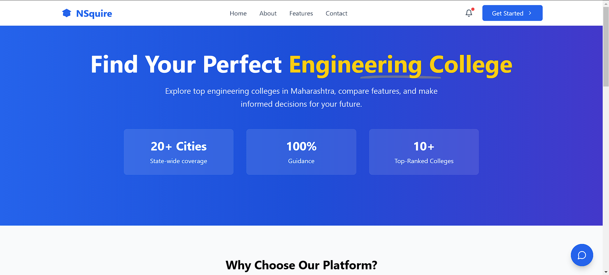
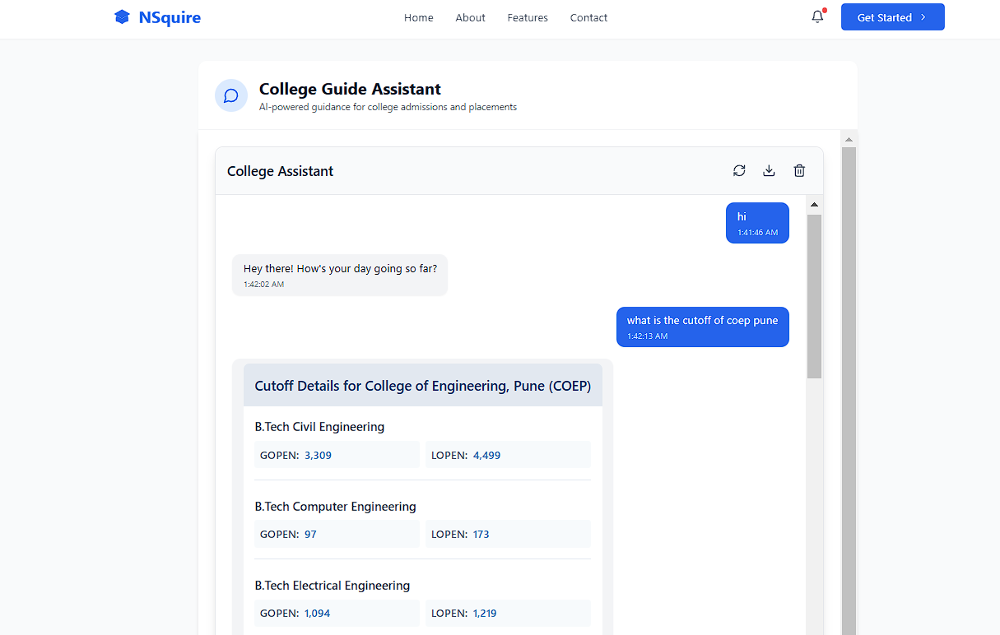
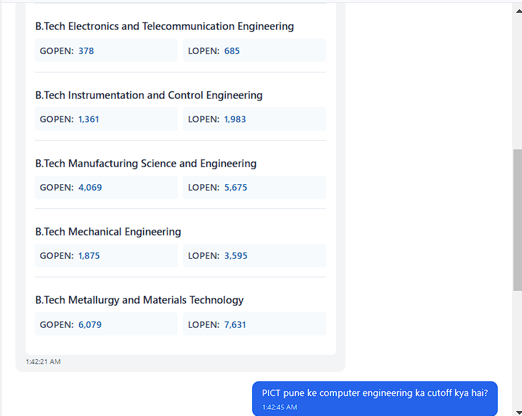
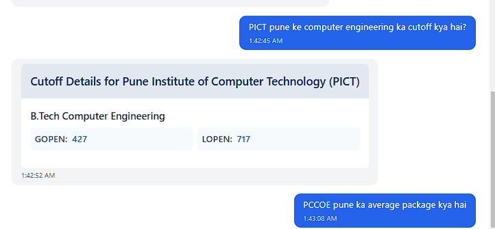

# NSquire - Maharashtra Engineering College Assistant 🎓



## About NSquire

NSquire is an AI-powered chatbot designed to help students in Maharashtra find information about engineering colleges. The assistant provides details about cutoffs, fees, placements, and other essential information to help students make informed decisions about their educational future.

## Features

- **College Information**: Get detailed information about engineering colleges in Maharashtra
- **Cutoff Details**: View branch-wise cutoff ranks for different categories (GOPEN, LOPEN)
- **Fee Structure**: Check course-wise fees for various colleges
- **Placement Information**: Get average and highest package details
- **Eligibility Search**: Find colleges you're eligible for based on your rank and category
- **Best College Recommendations**: Get personalized college recommendations
- **Multilingual Support**: Interact in both English and Hinglish

## Demo Screenshots

### Chat Interface


### College Cutoff Details


### Placement Details


### 


## Technologies Used

- **Python**: Core programming language for backend processing
- **React.js**: Frontend framework for building user interface
- **HTML/CSS**: Frontend structure and styling
- **Flask**: Backend web framework
- **Cohere**: NLP processing for intent extraction and text generation
- **FuzzyWuzzy**: Fuzzy string matching for college name recognition
- **Argos Translate**: Translation capabilities for multilingual support

## Technical Architecture

The chatbot follows this processing pipeline:
1. **Language Detection**: Identifies if the query is in English or Hinglish
2. **Intent Recognition**: Uses Cohere AI to extract intent and entities
3. **Entity Extraction**: Pulls out college names, branch details, ranks, etc.
4. **Data Retrieval**: Fetches information from the dataset
5. **Response Generation**: Constructs appropriate responses based on intent
6. **Translation**: Translates responses if needed for Hinglish queries

## Project Structure

```
├── images/              # Screenshots and demo images
├── public/              # Public assets for React
├── src/                 # React source files
│   ├── components/      # React components
│   ├── styles/          # CSS styles
│   └── App.js           # Main React application
├── EDI_project.py       # Main application code
├── dataset1.json        # College database
├── Test.py              # Test implementation
├── .env                 # Environment variables (API keys)
├── package.json         # NPM package configuration
├── package-lock.json    # NPM package lock
├── tailwind.config.js   # Tailwind CSS configuration
├── README.md            # Project documentation
└── chatbot.log          # Logging file
```

## Key Components

### Intent Detection

The system recognizes various intents:
- `cutoff`: Query about college cutoff ranks
- `fees`: Query about college fees
- `highest_package`: Query about highest placement package
- `average_package`: Query about average placement package
- `info`: General information about a college
- `eligibility`: Query to find eligible colleges based on rank
- `best_college`: Query to find the best college from eligible options

### API Endpoints

The Flask application exposes the following endpoint:
- `/chat` (POST): Main endpoint for processing chat queries

## Sample Queries

Users can ask questions like:
- "What is the cutoff for VJTI Computer Engineering?"
- "PICT pune ke computer engineering ka cutoff kya hai?"
- "What are the fees for COEP?"
- "What is the highest package of VJTI?"
- "What colleges can I get with a rank of 5000 in GOPEN category?"
- "Which is the best college I can get with a 3000 rank?"

## Setup and Installation

1. Clone the repository
```bash
git clone https://github.com/yourusername/nsquire-college-assistant.git
cd nsquire-college-assistant
```

2. Install the required dependencies
```bash
pip install -r requirements.txt
npm install
```

3. Set up environment variables in .env file
```
COHERE_API_KEY=your_cohere_api_key_here
```

4. Run the backend server
```bash
python EDI_project.py
```

5. Start the React frontend
```bash
npm start
```

6. The backend server will start at `http://localhost:5001` and frontend will be at `http://localhost:3000`

## Requirements

- Python 3.8+
- Node.js and npm
- Flask
- React.js
- Cohere API key
- FuzzyWuzzy
- Argostranslate
- Flask-CORS

## Future Enhancements

- Add support for more regional languages
- Expand the college database to include more institutions
- Implement a more user-friendly web interface
- Add more features like college comparison
- Integrate with admission portals

## License

This project is licensed under the MIT License - see the LICENSE file for details.

## Acknowledgements

- Cohere for providing the NLP capabilities
- Maharashtra State CET Cell for cutoff data reference
